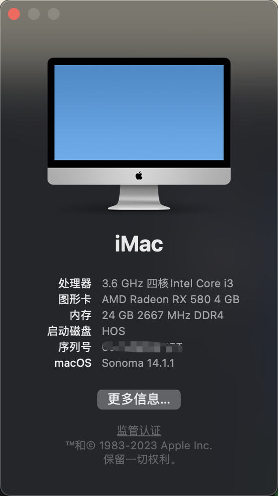
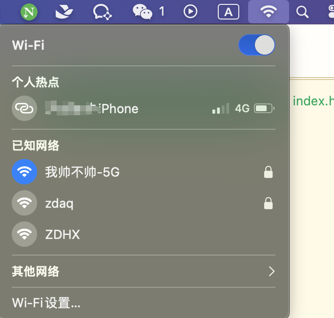
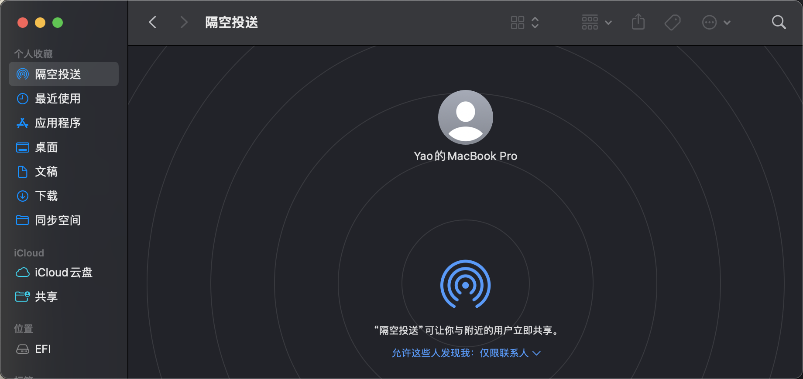

# 10100-b450m_sonoma_efi

## 硬件配置
|组件|型号|
|------|------|
|主板|微星 B460M MORTAR|
|CPU|Intel i3 10100|
|内存|威刚万紫千红 8GB * 2 2666MHz|
|显卡| rx580 |
|SSD-m.2| 海康威视eco2000 512GB |
|电源|航嘉冷静王 350W|
|声卡|板载Realtek ALC1200|
|机箱|乔思伯u4|
|散热|利民AX120 R SE 标配|
|网卡| BCM94360CS2|

## 功能测试
- ✅ usb定制
- ✅ 无线网卡
- ✅ 板载网卡（以太网）
- ✅ 隔空投送
- ✅ 接力
- ✅ 核显硬件加速
- ✅ DP 4K输出
- ✅ HIDPI
- ✅ 声卡驱动
- ✅ 睡眠唤醒
- ✅ 蓝牙
- ✅ 随航
- ✅ 摄像头
- ✅ 麦克风
- [ ] 核显硬件加速
- [ ] usb定制

## 工具
- [OC Auxiliary Tools](https://github.com/ic005k/OCAuxiliaryTools/releases)
- [OpenCore Legacy Patcher](https://github.com/dortania/OpenCore-Legacy-Patcher/releases)

## 参照教程
- [OpenCore Install Guide](https://dortania.github.io/OpenCore-Install-Guide/)
- [全网最详细的黑苹果EFI配置教程](https://www.bilibili.com/video/BV1194y1C7tn/?spm_id_from=333.788.recommend_more_video.1&vd_source=bf71553eb76e9df9a82422e2e8c76e9b)
- [自己制作黑苹果EFI文件](https://www.bilibili.com/video/BV15q4y1M7wq/?spm_id_from=333.999.0.0&vd_source=bf71553eb76e9df9a82422e2e8c76e9b)
- [「黑苹果」免驱网卡，找回macOS Sonoma消失的WiFi](https://www.bilibili.com/video/BV1n94y1t7Ka/?spm_id_from=333.337.search-card.all.click&vd_source=bf71553eb76e9df9a82422e2e8c76e9b)
- [黑苹果应用闪退报错解决方法 | SIP关闭](https://www.bilibili.com/video/BV1Wy4y1R7hd/?spm_id_from=333.999.0.0&vd_source=bf71553eb76e9df9a82422e2e8c76e9b)
- [广色域时代已到来！教你如何正确设置mac外接显示器（修正版）](https://www.bilibili.com/video/BV16C4y1V79M/?spm_id_from=333.999.0.0&vd_source=bf71553eb76e9df9a82422e2e8c76e9b)
- [安装完黑苹果后的各种常见问题解决方案](https://www.bilibili.com/video/BV1kQ4y1r7LW/?spm_id_from=333.999.0.0&vd_source=bf71553eb76e9df9a82422e2e8c76e9b)

## 截图
 
 
 